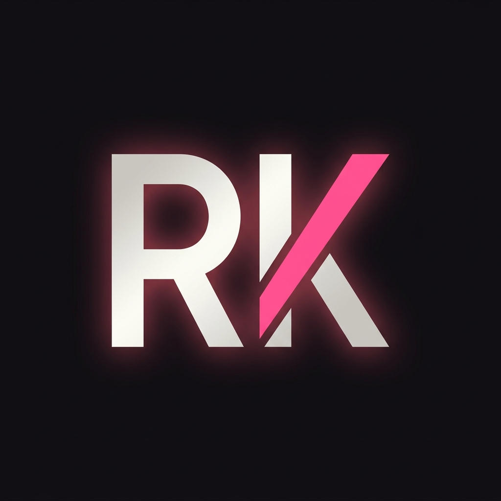

<div align="center">



# ✨ Riya Kumari — Portfolio

### Full Stack Developer · MCA Graduate · Bihar, India

[](https://riyakumari-source.github.io/portfolio)
[](https://www.linkedin.com/in/riya-kumari-93937b307)
[](https://github.com/Riyakumari-source)
[](mailto:riakri0207@gmail.com)

> **💼 Open to Full-Time Software Developer Opportunities · Open to Relocate**

</div>

---

# 🎯 About This Portfolio

Welcome! I'm **Riya Kumari**, an MCA graduate and Full Stack Developer passionate about building modern, responsive, and user-focused web applications.

This portfolio showcases my technical skills, featured projects, education, and development journey through an interactive web experience built with **React**, **TypeScript**, **GSAP**, and modern frontend technologies.

---

# ✨ Features

* 🌑 **Modern Dark Theme**: Designed with custom pink & violet accent colors.
* 🎭 **Animated Developer Avatar**: Custom 2D character integrated across multiple sections with smooth transitions.
* 📜 **Smooth Scroll**: Natural and fluid scrolling experience powered by Lenis.
* ⚡ **Scroll-Triggered Animations**: Modern entrance effects using GSAP & ScrollTrigger.
* 🪄 **Typography Animations**: Word-by-word cinematic heading animations (SplitText).
* 🎱 **Interactive 3D Tech Stack**: Powered by Three.js, React Three Fiber, and Rapier physics (colliding bubble bubbles that repel on mouse hover).
* ⬢ **Accordion Skill sets & Hexagon Cards**: Category-wise accordion revealing crisp SVG hexagon cards with dynamic circular skill meters.
* 🃏 **Project Carousel**: Slidable container displaying key development projects.
* 📱 **Fully Responsive**: Optimized for desktop, tablet, and mobile screen layouts.
* 🚀 **Clean Code & Performance**: Focused on premium animations without sacrificing loading speed.

---


# 🛠️ Tech Stack

| Layer | Technologies |
|---|---|
| **Frontend** | React 18, TypeScript |
| **Build Tool** | Vite 5 |
| **Animations** | GSAP, ScrollTrigger, Lenis |
| **3D Graphics** | Three.js, React Three Fiber, Drei, Rapier |
| **Styling** | Vanilla CSS, CSS Variables |
| **Deployment** | Vercel |

---

# 📁 Project Structure

```text
portfolio/
├── public/
│   ├── images/              # Screen assets and static textures
│   ├── internship_certificate.pdf
│   └── rk-logo.png
│
├── src/
│   ├── assets/              # Assets categorized into images/icons/resume/logos
│   ├── components/          # Modular component blocks
│   │   ├── common/          # Reusable atoms (Buttons, Cards, Title layouts)
│   │   ├── layout/          # Page structural frames (Navbar, Footer, Loader)
│   │   └── ui/              # Interactive components (Skill hexagons, TechBall, TimelineCard)
│   ├── sections/            # Page major section containers (Hero, About, Skills, Projects, etc.)
│   ├── hooks/               # State/trigger hooks (useCursor, useScrollAnimation, useActiveSection)
│   ├── data/                # Separated lists for project nodes, experience logs, and tools
│   ├── animations/          # Timelines setup for hero, carousel slides, and carrier bounce
│   ├── constants/           # Main accent keys and links configuration
│   ├── styles/              # Unified globals.css stylesheet
│   ├── types/               # Type definition files
│   ├── utils/               # Text splitters and math utilities
│   ├── App.tsx              
│   └── main.tsx             
│
├── package.json             
├── tsconfig.json            
├── vite.config.ts           
└── README.md                
```

---

# 📂 Portfolio Sections

| Section | Description |
|---|---|
| 🏠 Hero | Introduction with animated visuals and quick overview |
| 👩 About | Personal introduction, background, and career objective |
| 💻 Skills | Technical skills categorized by technology stack |
| 🎓 Career | Education, internship, and professional journey |
| 🚀 Projects | Featured development projects with live demos and source code |
| ⚙️ Tech Stack | Interactive visualization of technologies I work with |
| 📬 Contact | Professional contact information and social profiles |

---

# 🚀 Featured Projects

*   **WorkTrack Pro** — Workforce Monitoring & Productivity Platform
*   **Hotel Management System** — Java & MySQL Desktop Application
*   **Personal Portfolio** — Interactive React Portfolio Website

---

# 🌱 Currently Learning

*   Advanced React Patterns
*   Backend Development & System Design
*   Cloud Deployment Fundamentals
*   AI-assisted Software Development

---

# 🏃 Run Locally

Follow these steps to set up and run the portfolio on your local machine:

```bash
# Clone the repository
git clone https://github.com/Riyakumari-source/portfolio.git

# Navigate to directory
cd portfolio

# Install dependencies
npm install

# Start local dev server
npm run dev
```

---

# 📦 Production Build

```bash
npm run build
```

---

# 📬 Connect With Me

| Platform | Link |
|---|---|
| 📧 **Email** | [riakri0207@gmail.com](mailto:riakri0207@gmail.com) |
| 💼 **LinkedIn** | [linkedin.com/in/riya-kumari-93937b307](https://www.linkedin.com/in/riya-kumari-93937b307) |
| 🐙 **GitHub** | [github.com/Riyakumari-source](https://github.com/Riyakumari-source) |
| 📍 **Location** | Bihar, India |
| 💼 **Availability** | Open to Full-Time Opportunities & Open to Relocate |

---

<div align="center">

### ⭐ Thanks for visiting my portfolio!

If you like my work, feel free to connect with me on LinkedIn or explore my GitHub repositories.

**Developed by Riya Kumari**

</div>
